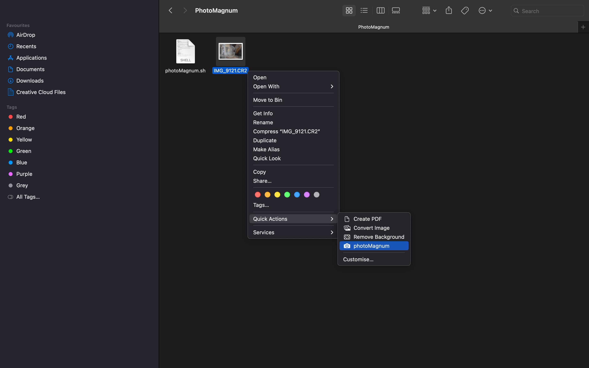
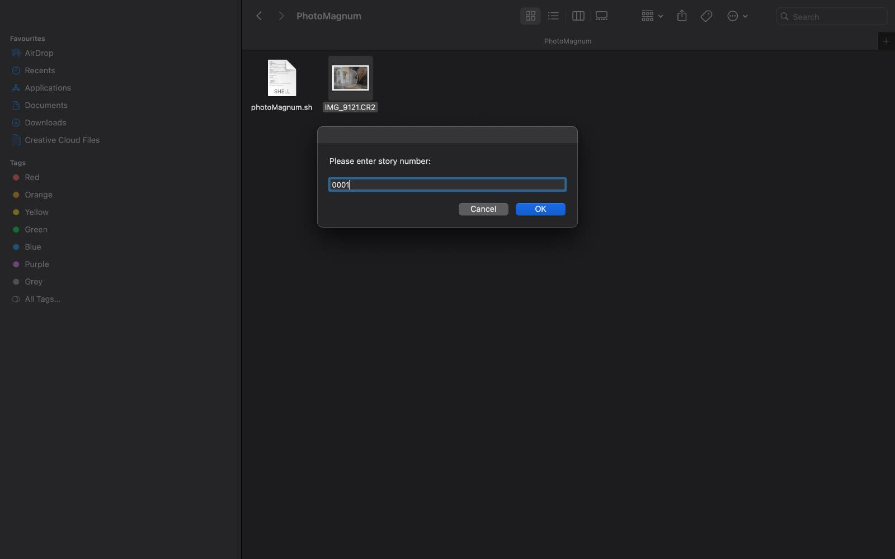
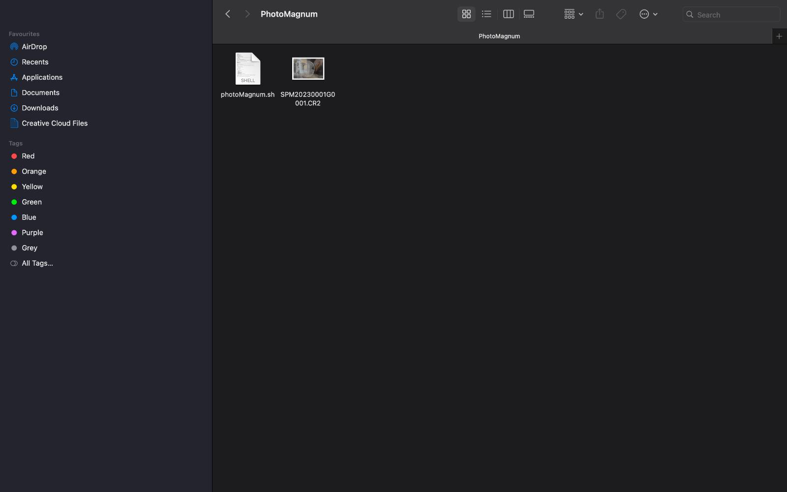
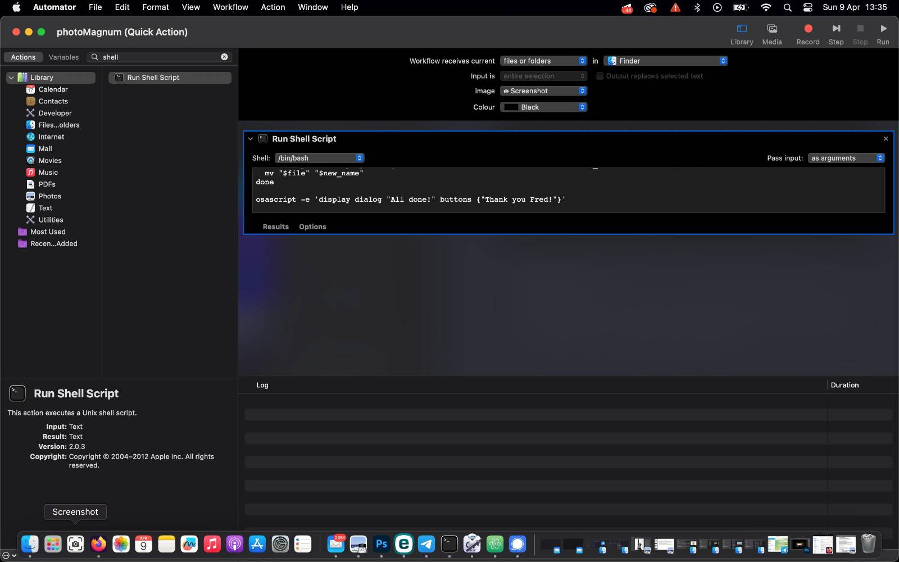

#PhotoMagnum Script for Photographers

PhotoMagnum is a script designed to assist photographers renaming selected files on MacOS using the Magnum Unique Numbering System.

The script must be added to Automator and can be used by selecting a group of files and right-clicking to open the context menu.

##Requirements

    MacOS Operating System
    Automator application
    A set of files to rename

##Installation

    Clone or download the repository to your local machine.
    Open Automator.
    Click "File" -> "Import Actions" and select the PhotoMagnum.workflow file.
    The PhotoMagnum script will now be available in Automator.

##Usage

    Select a group of files in Finder.
    Right-click on the selection and click on "Quick Actions" and then on "PhotoMagnum".
    The script will ask the story number of those files, and automatically rename the files,
    according to the Magnum Unique Numbering System.

##Customization

The script uses a simplified version of the Magnum Unique Numbering System.
Customise the first lines of the script to your own needs.

    Open Automator and select the PhotoMagnum workflow.
    Double-click on the "Run Shell Script" action.
    Modify the script (all important variable are in the first lines of the script).
    Save the workflow.

##License
**Developed by Frédéric Bogaerts**
This project is licensed under the GPLv2 License. Please see the LICENSE file for details.

##**Please support my work if you find it useful!**
**#EveryBeerIsWelcome! XD**
**www.netpack.pt**
**Thank you!**
